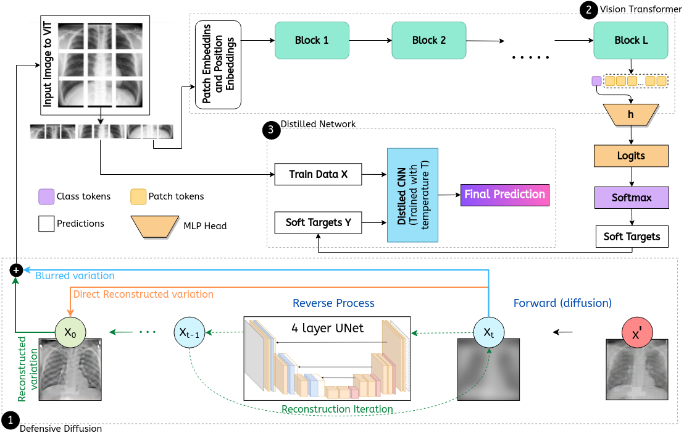

# On enhancement of SEVIT for Chest XRay Classification using Defensive Distillation and Adversarial Training. 

## Abstract 
Privacy and confidentiality of medical data are of utmost importance in healthcare
settings. ViTs, the SOTA vision model, rely on large amounts of patient data for
training, which raises concerns about data security and the potential for unauthorized access. Adversaries may exploit vulnerabilities in ViTs to extract sensitive
patient information and compromising patient privacy. This work address these vulnerabilities to ensure the trustworthiness and reliability of ViTs in medical applications. In this work, we introduced a defensive diffusion technique as an adversarial
purifier to eliminate adversarial noise introduced by attackers in the original image.
By utilizing the denoising capabilities of the diffusion model, we employ a reverse
diffusion process to effectively eliminate the adversarial noise from the attack sample, resulting in a cleaner image that is then fed into the ViT blocks. Our findings
demonstrate the effectiveness of the diffusion model in eliminating attack-agnostic
adversarial noise from images. Additionally, we propose combining knowledge
distillation with our framework to obtain a lightweight student model that is both
computationally efficient and robust against gray box attacks. Comparison of our
method with a SOTA baseline method, SEViT, shows that our work is able to
outperform the baseline. Extensive experiments conducted on a publicly available
Tuberculosis X-ray dataset validate the computational efficiency and improved
robustness achieved by our proposed architecture.
## Keywords
Diffusion · Adversarial Defense · Distillation
